# Modelo de Datos — Mya Dynamics

## Resumen
Este documento describe el modelo relacional usado por el backend (Supabase/Postgres). Incluye las tablas principales, relaciones y diccionario de campos extraído de `supabase/schema.sql` y las migraciones en `supabase/migrations/`.

## Diagrama ER (Mermaid)

```mermaid
erDiagram
  FIXED_COURSES {
    uuid id PK
    text user_key
    text course_code
    text name
    text category
    text day_of_week
    time start_time
    time end_time
    boolean es_fijo
    boolean is_exercise
    text emoji
    jsonb checklist
  }
  COURSE_CHECKLISTS {
    uuid id PK
    text user_key
    uuid course_id FK
    text course_code
    jsonb items
    boolean completed
  }
  USER_CONFIGS {
    uuid id PK
    text user_key
    jsonb subscription
    text timezone
    integer notification_hour_start
    integer notification_hour_end
  }
  USER_SCHEDULES {
    uuid id PK
    uuid user_id FK
    jsonb schedule
    text timezone
  }
  USER_COMPLETIONS {
    uuid id PK
    uuid user_id FK
    text date
    jsonb completed_ids
  }
  USER_EXCEPTIONS {
    uuid id PK
    uuid user_id FK
    text week_key
    text activity_id
    jsonb modified_data
  }
  USER_SETTINGS {
    uuid id PK
    uuid user_id FK
    integer notification_hour_start
    integer notification_hour_end
    boolean onboarding_completed
    text user_name
  }

  FIXED_COURSES ||--o{ COURSE_CHECKLISTS : has
  AUTH_USERS ||--o{ USER_SCHEDULES : owns
  AUTH_USERS ||--o{ USER_COMPLETIONS : owns
  AUTH_USERS ||--o{ USER_EXCEPTIONS : owns
  AUTH_USERS ||--o{ USER_SETTINGS : owns
```

> Nota: `AUTH_USERS` representa `auth.users` (esquema de autenticación de Supabase). Las tablas `user_*` referencian `auth.users(id)` cuando aplicable.

## Tablas y diccionario (extracted)

### `public.fixed_courses` (ver `supabase/schema.sql`)
- `id` uuid PK, default gen_random_uuid()
- `user_key` text NOT NULL
- `course_code` text
- `name` text NOT NULL
- `category` text NOT NULL
- `day_of_week` text NOT NULL
- `start_time` time NOT NULL
- `end_time` time NOT NULL
- `es_fijo` boolean NOT NULL DEFAULT true
- `is_exercise` boolean NOT NULL DEFAULT false
- `emoji` text
- `custom_color` text
- `checklist` jsonb NOT NULL DEFAULT '[]'::jsonb
- `created_at` timestamptz NOT NULL DEFAULT now()
- `updated_at` timestamptz NOT NULL DEFAULT now()

Índices: `fixed_courses_user_key_idx`, `fixed_courses_day_idx` (user_key, day_of_week)

### `public.course_checklists`
- `id` uuid PK, default gen_random_uuid()
- `user_key` text NOT NULL
- `course_id` uuid NOT NULL REFERENCES public.fixed_courses(id) ON DELETE CASCADE
- `course_code` text NOT NULL
- `items` jsonb NOT NULL DEFAULT '[]'::jsonb
- `completed` boolean NOT NULL DEFAULT false
- `created_at` timestamptz NOT NULL DEFAULT now()
- `updated_at` timestamptz NOT NULL DEFAULT now()
- Unique constraint: `(user_key, course_id)`

Índices: `course_checklists_user_key_idx`, `course_checklists_course_idx`, `course_checklists_code_idx`

### `public.user_configs`
- `id` uuid PK default gen_random_uuid()
- `user_key` text NOT NULL UNIQUE
- `subscription` jsonb
- `timezone` text NOT NULL DEFAULT 'America/Santo_Domingo'
- `notification_hour_start` integer DEFAULT 7
- `notification_hour_end` integer DEFAULT 21
- `last_reset_date` date
- `created_at` timestamptz NOT NULL DEFAULT now()
- `updated_at` timestamptz NOT NULL DEFAULT now()

Índice: `user_configs_user_key_idx`

### `public.user_schedules` (migrations)
- `id` uuid PK default gen_random_uuid()
- `user_id` uuid NOT NULL REFERENCES auth.users(id) ON DELETE CASCADE
- `schedule` jsonb NOT NULL DEFAULT '[]'::jsonb
- `timezone` text DEFAULT 'America/Lima'
- `created_at` timestamptz DEFAULT now()
- `updated_at` timestamptz DEFAULT now()
- UNIQUE(user_id)

Índices: `user_schedules_user_id`

### `public.user_completions`
- `id` uuid PK
- `user_id` uuid NOT NULL REFERENCES auth.users(id) ON DELETE CASCADE
- `date` text NOT NULL
- `completed_ids` jsonb DEFAULT '{}'::jsonb
- `created_at` timestamptz DEFAULT now()
- `updated_at` timestamptz DEFAULT now()
- UNIQUE(user_id, date)

Índices: `user_completions_user_id`, `user_completions_user_date`

### `public.user_exceptions`
- `id` uuid PK
- `user_id` uuid NOT NULL REFERENCES auth.users(id) ON DELETE CASCADE
- `week_key` text NOT NULL -- formato YYYY-WW
- `activity_id` text NOT NULL
- `modified_data` jsonb NOT NULL
- `created_at`, `updated_at` timestamps
- UNIQUE(user_id, week_key, activity_id)

Índices: `user_exceptions_user_id`, `user_exceptions_week_key`

### `public.user_settings`
- `id` uuid PK
- `user_id` uuid NOT NULL REFERENCES auth.users(id) ON DELETE CASCADE
- `notification_hour_start` integer DEFAULT 7
- `notification_hour_end` integer DEFAULT 22
- `onboarding_completed` boolean DEFAULT FALSE
- `user_name` text
- `created_at`, `updated_at` timestamps
- UNIQUE(user_id)

Índice: `user_settings_user_id`

## RLS y políticas clave
- `supabase/schema.sql` y las migraciones habilitan Row Level Security (RLS) en las tablas públicas y crean políticas que restringen acceso por rol o por `auth.uid()` según la tabla:
  - `fixed_courses`, `course_checklists`, `user_configs` tienen políticas que permiten lectura/escritura a `authenticated` y `anon` (según configuración histórica del proyecto).
  - `user_schedules`, `user_completions`, `user_exceptions`, `user_settings` usan políticas que restringen por `auth.uid()` (ver `supabase/migrations/20260509_0002_user_tables.sql`).

## Notas operacionales y recomendaciones
- Aplique las migraciones en el orden provisto (`20260506_0001_mya_dynamics.sql`, `20260509_0002_user_tables.sql`, `20260512_0003_reminder_windows.sql`) en su proyecto Supabase para crear las tablas y políticas necesarias.
- Verifique índices y las constraints únicas para prevenir upserts duplicados.
- Considere añadir `updated_by` o `last_modified_by` si se requiere auditoría por usuario.

---
Archivo generado automáticamente: MODELO_BASE_DATOS.md
